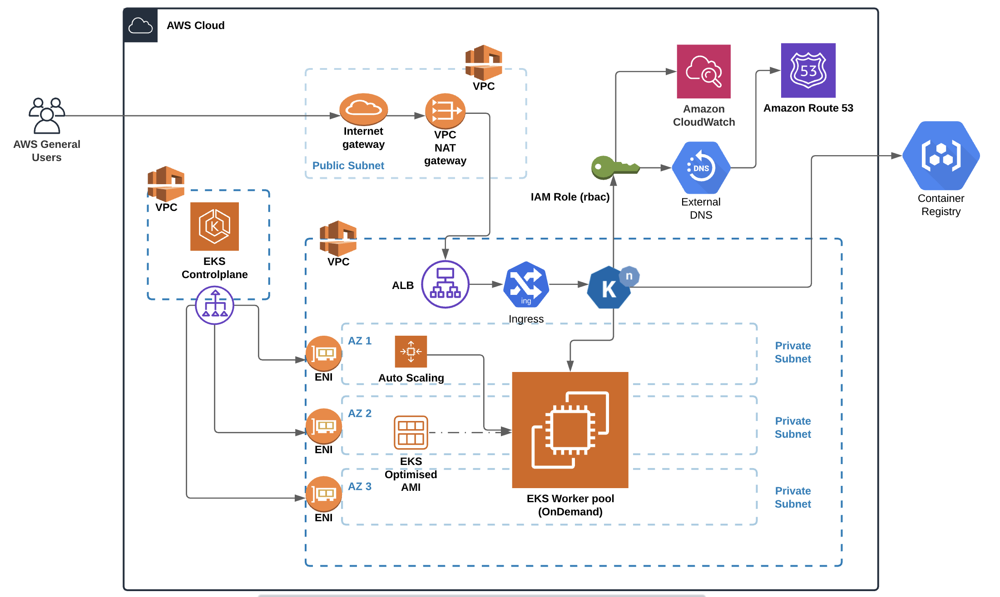
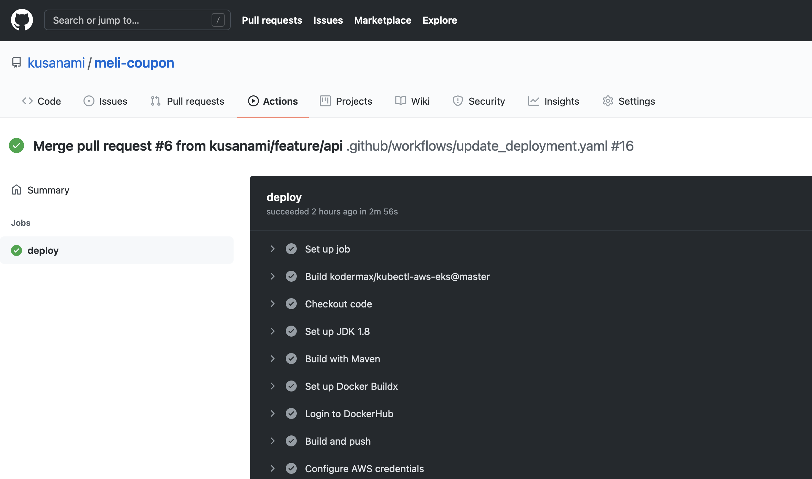
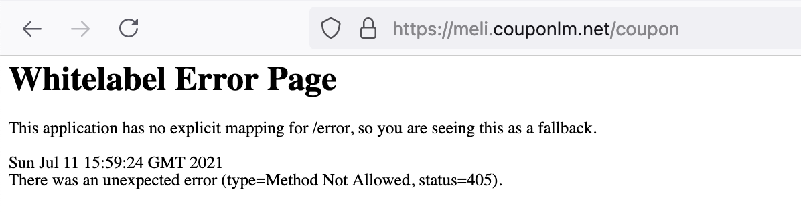

# Meli Coupon  

<https://meli.couponlm.net>

## Exercise:

Mercado Libre is implementing a new benefit for users who use the platform the most with a coupon of a certain amount for free that will allow them to buy as many items marked as favorites that do not exceed the total amount. For this, we are analyzing building an API that given a list of item_id and the total amount can give you the list of items that maximizes the total spent without exceeding it.

In order to complete the deployment of the Meli Coupon application, it is necessary to take into account the following information:

## Architecture



The selected architecture is an **EKS cluster** on AWS with autoscaling and with high availability using different high availability zones.

Basically, an application loadbalancer receives the requests and through an ingress sends them to the kubernetes cluster, there is the deployment using the built image of our application.

In addition to the autoscaler cluster to grow the cluster in nodes, knative has been used to scale the application horizontally, **knative allows scaling based on received traffic**, which is a great feature that allows the application to be adapted based on consumption.


## Infraestructure

The creation of the infrastructure to be used in amazon web services is carried out with terraform scripts, the necessary steps for its execution are found in: **[Installation](docs/Infraestructure.md)**

## Build

To build the **Meli Coupon application** locally, just execute the following instructions:

```bash
cd ${git_home}/meli-coupon/
mvn clean test package
docker build -t ${registry}/${service-name} .
docker push ${registry}/${service-name}
```

However, if you want to deploy in the current **AWS Cloud** infrastructure, just make the changes in the repository and create the respective **pull request to the main branch**. Github Actions will take care of updating the application automatically.

For more details of the building process and unit tests reports see: **[Build](docs/Build.md)**


## Time to deploy!

To deploy the service it is enough to go to the **actions** tab in our repository and execute the workflow, just one click. The workflow will also be executed when **the repository has a change in its main branch**, that is, when there is a pull request and it is mixed, the application will be updated automatically.




Currently we can consume the service in:

<https://meli.couponlm.net>




## Testing the application

To do tests on the application, the following request can be made, the service will return the items that the user can purchase according to the list sent and the value of the coupon, for instance:

```
curl --location --request POST 'https://meli.couponlm.net/coupon' \
--header 'Content-Type: application/json' \
--data-raw '{
    "items": [
        "MLA811601010",
        "MLA816019440",
        "MLA810645375",
        "MLA811601014"
    ],
    "amount": 19000.00
}'
```

The response obtained should be something similar to:

```
["MLA810645375","MLA811601014"]
```
A folder with a collection of postman has been included to consume the service, a jmeter script has also been included where performance tests were done. To know a little more about the tests and the behavior of the application you can consult: **[Testing](docs/Testing.md)**


I have a problem, who should I contact?

* Me ( Luis Miguel Ruiz - *luism_fr@hotmail.com* )
