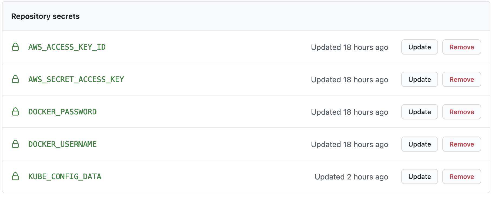
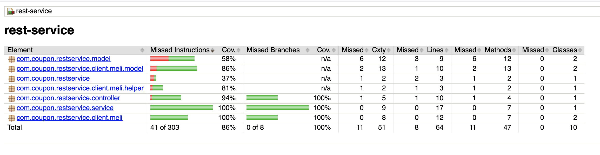

## Configuration

**Github Actions** has been selected for deployment pipeline creation due to its low complexity and fast development.
The following secret configuration needs to be created before pipeline execution:

- **AWS secret and access key** (As shown in the picture)
- **Username and password for docker hub** (or container registry used)
- **KUBE_CONFIG_DATA**: A base64-encoded kubeconfig file with credentials for Kubernetes to access the cluster. You can get it by running the following command: `cat ${GIT_HOME}/meli-coupon/infrastucture/config | base64`

The docker image is built automatically when changes are detected in its main branch, additionally the application update is also carried out automatically using this pipeline.

## Unit tests

For the unit tests, the jacoco plugin has been selected and it is only necessary to run the tests with maven. La ubicación del reporte de pruebas es `${git_home}/meli-coupon/target/site/index.html`

