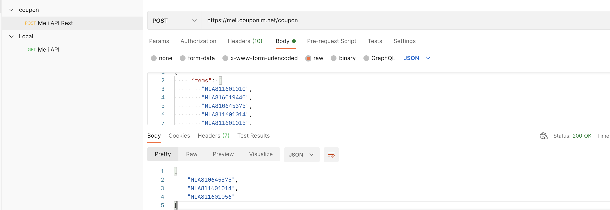
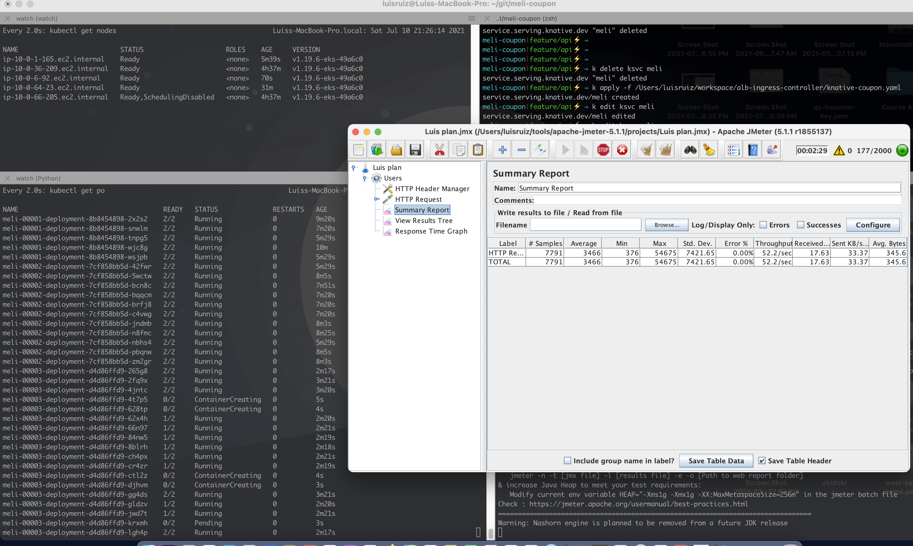

## Testing



To do tests on the application, the following request can be made, the service will return the items that the user can purchase according to the list sent and the value of the coupon, for instance:

```
curl --location --request POST 'https://meli.couponlm.net/coupon' \
--header 'Content-Type: application/json' \
--data-raw '{
    "items": [
        "MLA811601010",
        "MLA816019440",
        "MLA810645375",
        "MLA811601014"
    ],
    "amount": 19000.00
}'
```

The response obtained should be something similar to:

```
["MLA810645375","MLA811601014"]
```

A collection postman  script has been included to consume the service in `${git_home}/meli_coupon/docs/scripts/`,also a jmeter script has been added where performance tests were done.


